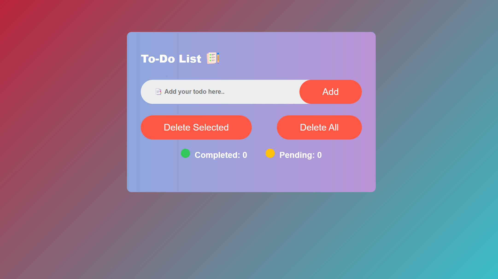
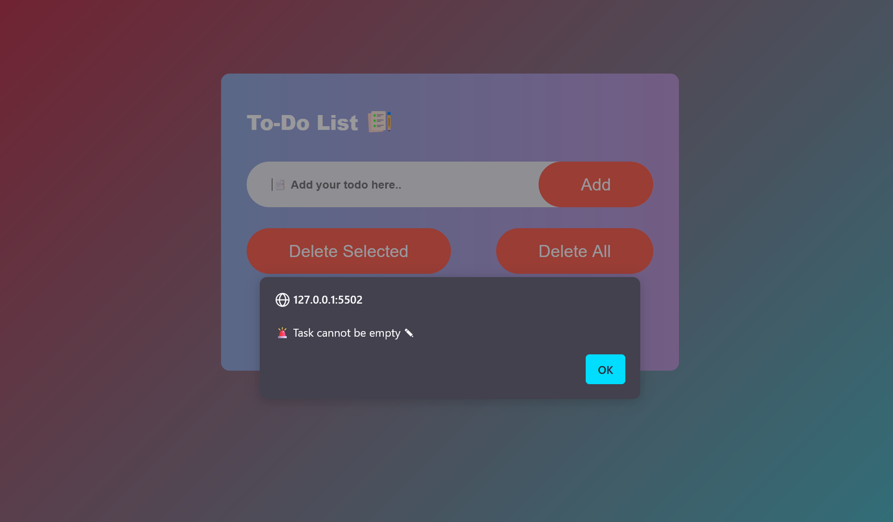
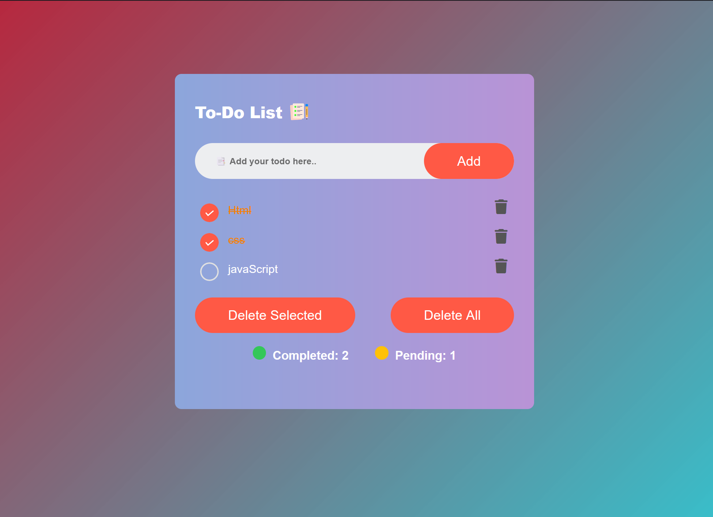

# To-Do-List
This is a simple **to-do list** website built using **HTML, CSS, and JavaScript**. Users can enter their tasks or to-do items in a search bar and manage them on the webpage.

# Features 
- **Add Tasks** :  Users can enter tasks in the search bar and add them to the list using either the Enter key or an "Add" button.
- **Validation** :  If the user tries to add a task with an empty input (by pressing Enter or clicking the "Add" button without entering anything), a message **"🚨 Task cannot be empty ✎"** will be displayed.
- **Delete Tasks** :  Users can delete individual tasks by clicking on them. There is also an option to delete all tasks at once.
- **Task Status** :  The website shows the total number of tasks, how many tasks are completed, and how many are pending.
- **Persistence** :  Tasks are stored **locally** in the browser, so they remain even if the user refreshes the page or closes and reopens the website.

# Technologies Used
- ### HTML
- ### CSS
- ### JavaScript

# How to Use
### Adding Tasks :
- Enter a task in the input field and press **Enter** or click the **"Add"** button to add it to your to-do list.
- If you try to add a task without entering anything, a message "🚨 Task cannot be empty ✎" will be displayed.
### Managing Tasks
- Click on a task to mark it as completed. Click again to undo.
- Click the trash can icon next to a task to delete it from the list or click on delete selected button.
- Use the "Delete All" button to remove all tasks from the list.

# Application Snapshots

